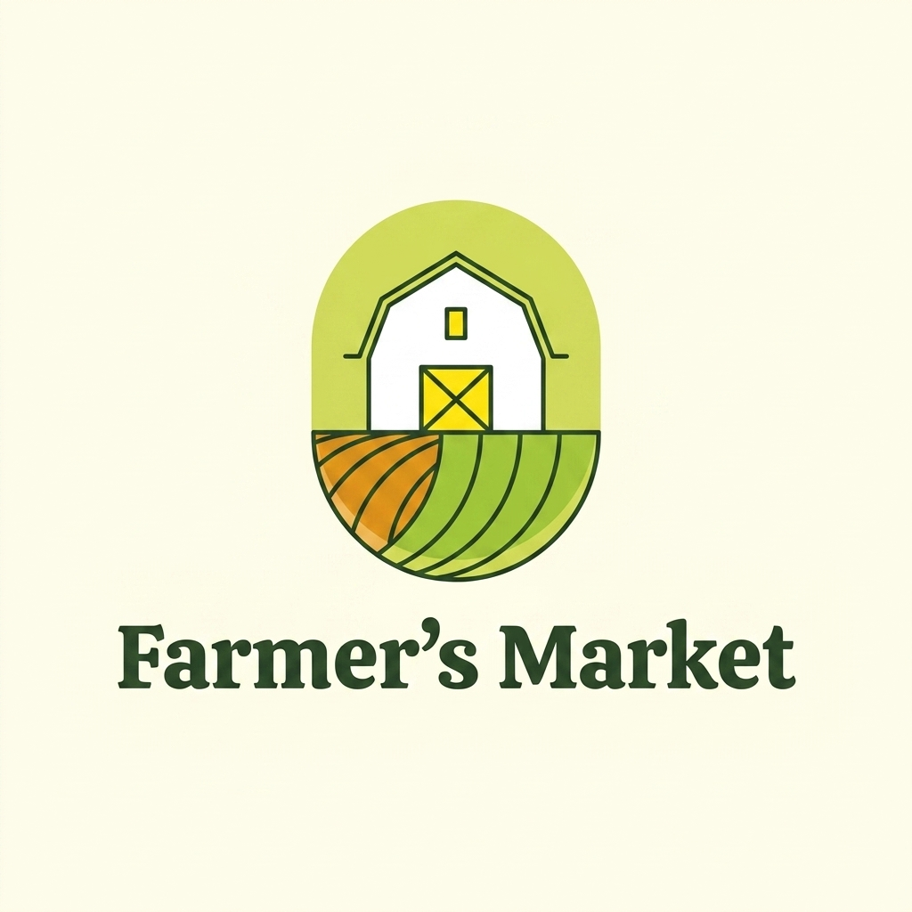

<div align="center">
  

  # Farmer's Market

  > 지역 농가와 소비자를 직접 연결하는 직거래 플랫폼

  
  
  
  
</div>

---

## 실행 화면

> 스크린샷을 `docs/screenshots/` 폴더에 추가한 뒤 아래 경로를 수정해주세요.

| 홈 화면 | 농가 목록 |
|:---:|:---:|
|  |  |

| 상품 상세 | 마이페이지 |
|:---:|:---:|
|  |  |

| 농가 대시보드 | 관리자 |
|:---:|:---:|
|  |  |

---

## 서비스 소개

대형 유통망을 거치지 않고 지역 농가에서 소비자에게 신선한 농산물을 직접 공급합니다.
농가는 상품을 등록하고, 소비자는 평점·인증 기반으로 농가를 탐색하여 포인트로 구매합니다.
커뮤니티에서 구매 후기와 레시피를 공유할 수 있습니다.

---

## 기술 스택

| 영역 | 기술 |
|---|---|
| Frontend | React 18 + TypeScript + Vite + Tailwind CSS v4 |
| 상태관리 | Zustand |
| HTTP | Axios |
| 라우팅 | React Router v6 |
| Backend | Spring Boot 3.x + Spring Security + JPA |
| Database | PostgreSQL (Neon 클라우드) |
| 인증 | JWT + OAuth2 (카카오·구글) |
| 실시간 | SSE (Spring SseEmitter) |
| 문서 | Swagger UI (springdoc-openapi) |
| 배포 | Railway (Backend) + Vercel (Frontend) |
| CI/CD | GitHub Actions |

---

## 프로젝트 구조

```
LocalFoodMarket/
├── backend/                     # Spring Boot
│   └── src/main/java/com/localfood/
│       ├── domain/              # user·farm·product·order·review·post·point
│       └── global/              # config·exception·oauth2·security·util
├── frontend/                    # React + TypeScript
│   └── src/
│       ├── api/                 # axios 인스턴스 + 도메인별 API 함수
│       ├── components/          # 공통 컴포넌트 (Navbar, Footer …)
│       ├── pages/               # 페이지 컴포넌트
│       ├── store/               # Zustand 스토어
│       ├── hooks/               # 커스텀 훅
│       └── types/               # TypeScript 타입 정의
└── docs/
    ├── logo.png
    ├── ERD.md
    ├── API.md
    └── ARCHITECTURE.md
```

---

## 주요 기능

- **직거래 쇼핑** — 카테고리·인증·키워드 기반 농가·상품 탐색
- **포인트 결제** — 주문 시 재고 차감 + 포인트 차감 트랜잭션 원자적 처리
- **실시간 재고** — SSE로 재고 변동을 구독자에게 즉시 전달
- **소셜 로그인** — 카카오·구글 OAuth2, tempToken 기반 role 선택 플로우
- **커뮤니티** — 게시글(이미지·상품 태그)·댓글·좋아요
- **농가 대시보드** — 주문 알림 SSE, 상품 CRUD
- **관리자** — 농가 승인·반려, 사용자 관리

---

## 구현 현황

### Backend ✅ 완료

| 기능 | 상태 |
|---|---|
| 이메일 회원가입 / 로그인 (JWT) | ✅ |
| 카카오 · 구글 소셜 로그인 (OAuth2) | ✅ |
| 농가 CRUD + 관리자 승인 플로우 | ✅ |
| 상품 CRUD + 실시간 재고 SSE | ✅ |
| 주문 · 포인트 결제 (트랜잭션) | ✅ |
| 리뷰 (구매 확인 후 작성) | ✅ |
| 커뮤니티 게시글 · 댓글 · 좋아요 | ✅ |
| 이미지 업로드 (로컬 저장) | ✅ |
| 카카오 주소 검색 API 연동 | ✅ |
| 관리자 기능 (농가 승인 · 사용자 관리) | ✅ |
| Swagger UI | ✅ |
| 로컬 시드 데이터 | ✅ |

### Frontend ✅ 완료

| 기능 | 상태 |
|---|---|
| Vite + React + TypeScript 프로젝트 세팅 | ✅ |
| Tailwind CSS v4 + Modern Agrarian 디자인 시스템 | ✅ |
| axios 인스턴스 + JWT 인터셉터 | ✅ |
| Zustand 인증 스토어 | ✅ |
| React Router + PrivateRoute (role 기반) | ✅ |
| 도메인별 API 함수 (farm·product·order·post·point·admin) | ✅ |
| 홈 페이지 | ✅ |
| 로그인 / 회원가입 페이지 | ✅ |
| 소셜 로그인 OAuth2 콜백 처리 | ✅ |
| 농가 · 상품 목록 / 상세 페이지 | ✅ |
| 상품 주문 + 카카오 주소 검색 | ✅ |
| 마이페이지 (주문 내역 · 포인트 · 게시글) | ✅ |
| 커뮤니티 (목록 · 상세 · 글쓰기) | ✅ |
| SSE 실시간 재고 · 주문 알림 훅 | ✅ |
| 농가 대시보드 (통계 · 주문 처리 · 재고 현황 · 매출) | ✅ |
| 상품 관리 (등록 · 수정 · 삭제 모달) | ✅ |
| 관리자 페이지 (농가 승인 · 게시글 · 사용자 관리) | ✅ |
| 환경변수 분리 (.env.local / .env.production) | ✅ |
| 프로덕션 빌드 최적화 (청크 분리) | ✅ |

---

## 시작하기

### 환경 변수 설정

`backend/src/main/resources/application-local.yml` 에 아래 값을 채워주세요.

```yaml
spring:
  datasource:
    url: jdbc:postgresql://{host}/{db}
    username: {username}
    password: {password}
  security:
    oauth2:
      client:
        registration:
          kakao:
            client-id: {kakao-client-id}
            client-secret: {kakao-client-secret}
          google:
            client-id: {google-client-id}
            client-secret: {google-client-secret}

jwt:
  secret: {32자-이상-시크릿-키}

kakao:
  address:
    api-key: {kakao-rest-api-key}
```

### Backend 실행

```bash
cd backend
./gradlew bootRun
```

- API: `http://localhost:8080/api/v1`
- Swagger UI: `http://localhost:8080/api/v1/swagger-ui/index.html`
- 최초 실행 시 시드 데이터 자동 생성 (관리자 1 · 농가 3 · 상품 9 · 소비자 2)

### Frontend 실행

```bash
cd frontend
npm install
npm run dev
```

- 개발 서버: `http://localhost:5173`

> `frontend/.env.local` 에 환경변수가 미리 설정되어 있습니다.  
> 프로덕션 배포 전 `frontend/.env.production` 의 `{railway-domain}` 과 `VITE_KAKAO_ADDRESS_KEY` 를 실제 값으로 교체하세요.

---

## 시드 계정

| 역할 | 이메일 | 비밀번호 |
|---|---|---|
| 관리자 | admin@localfood.com | sdh48624@ |
| 농가 | farm1@localfood.com | farmerpass12 |
| 소비자 | consumer1@localfood.com | consumerpass12 |

---

## 문서

- [ERD](./docs/ERD.md)
- [API 명세](./docs/API.md)
- [아키텍처](./docs/ARCHITECTURE.md)
